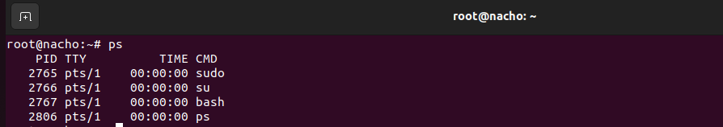
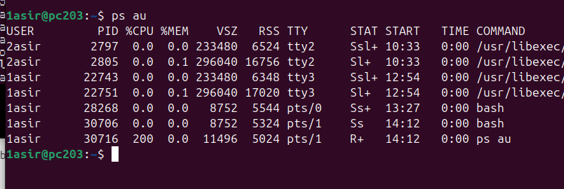
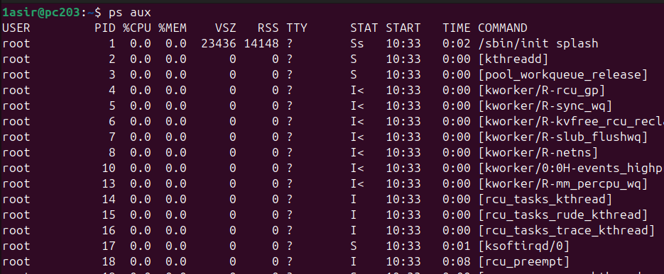
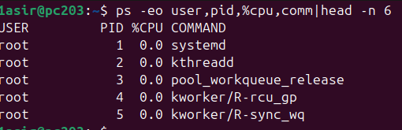
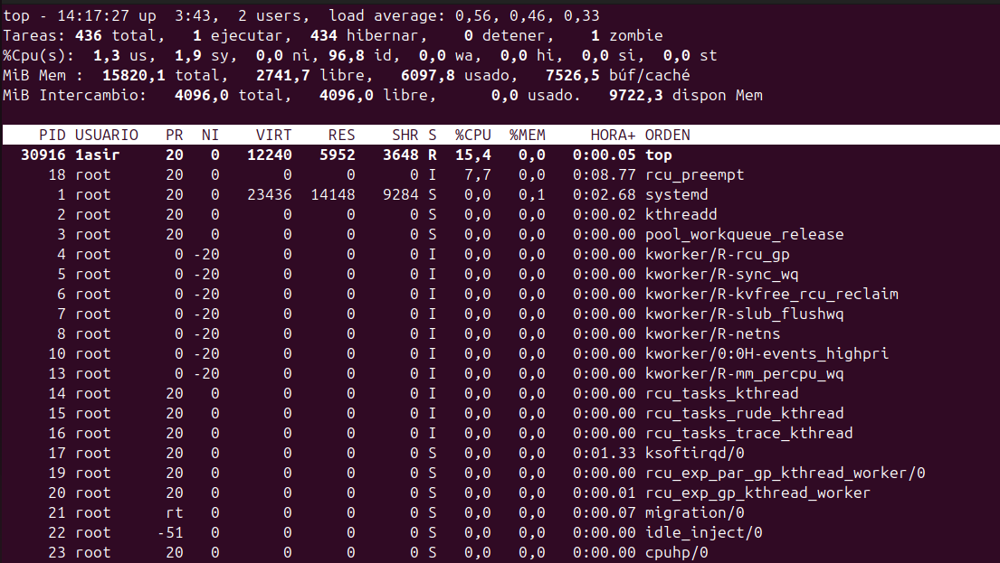
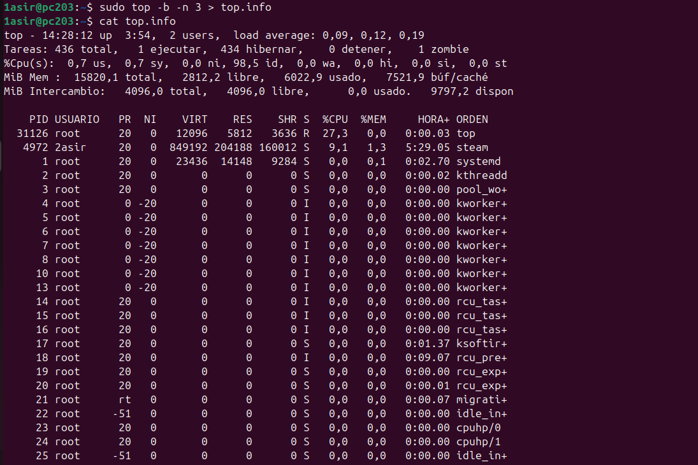
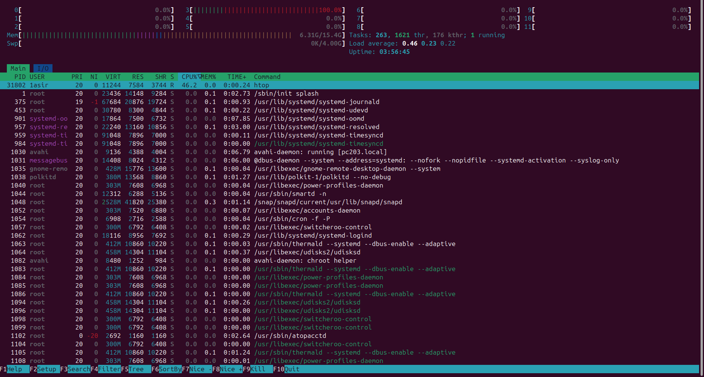
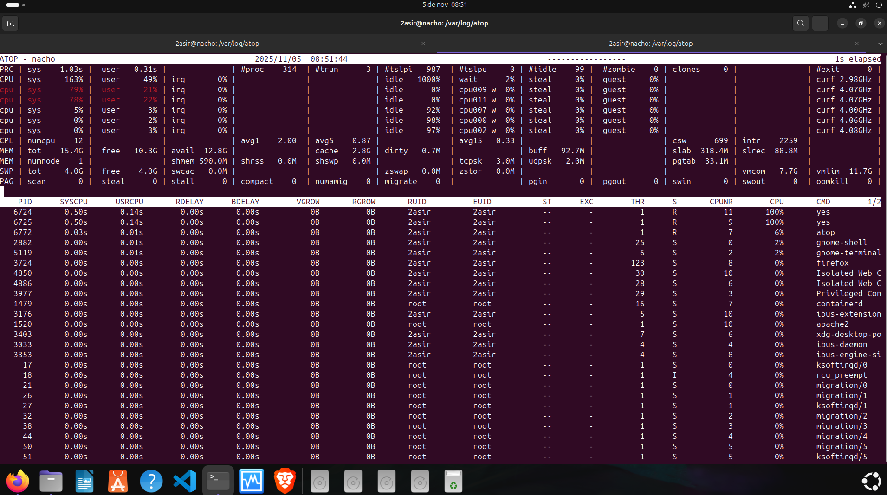

## [UD 1 PROCESOS](../README.md)
### [PS](#1-ps)
### [TOP](#2-top)

-----

### 1. PS

- `ps` --> Muestra información básica de los procesos que se estan ejecutando.

- `ps au` --> Muestra los procesos de los usuarios de forma detallada.

- `ps aux` --> Muestra una vision global de todos los procesos del sistema.

- `ps -eo user,pid,%cpu,comm|head -n 6` --> Muestra los procesos con las columnas que se indican, de manera personalizada.

  

  -----

  ### 2. TOP

- `top` --> Muestra en tiempo real y de forma dinamica los procesos ordenados por consumo de recursos.

**

- `top -b -n 3 >top.info` --> Ejecuta top en modo batch(El modo batch hace que la salida del comando sea en texto plano) por 3 iteraciones y las guarda en un fichero llamado info.top.

- `htop` --> Version interactiva y mas visual de top.

- `atop` --> Muestra la carga de cpu, memoria, disco y red del equipo.

