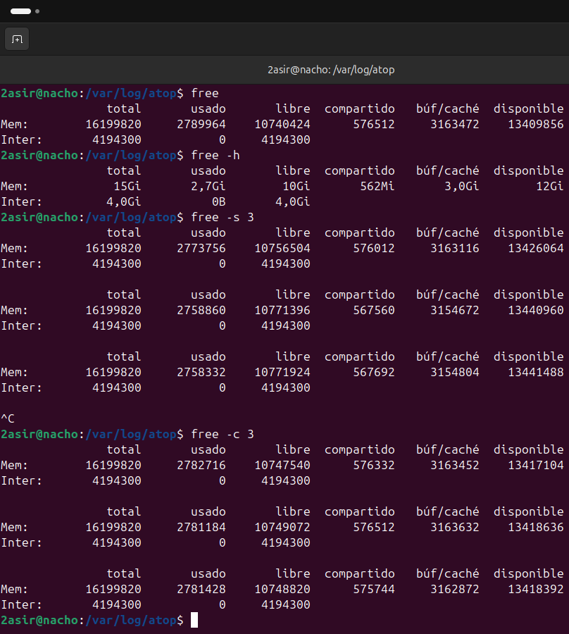
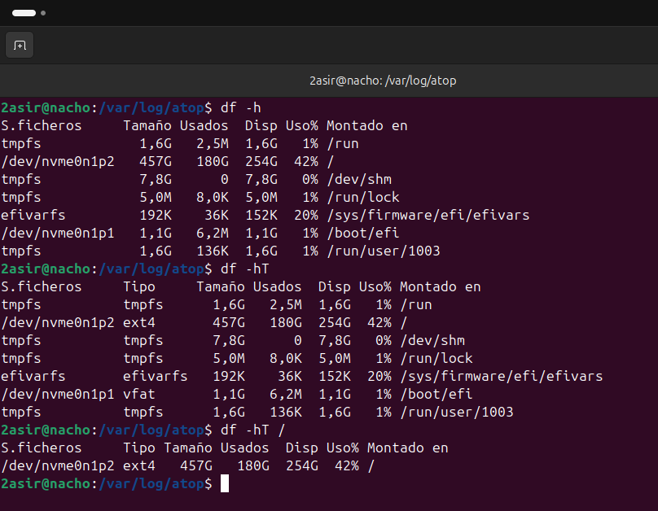
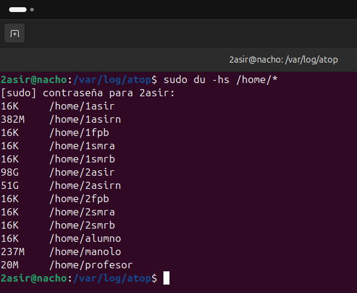
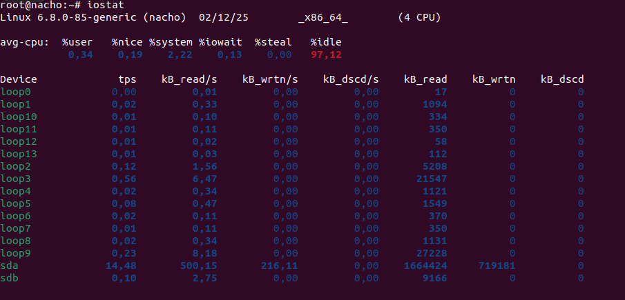

## [UD 1 Memoria y Rendimiento de discos](../README.md)
### [FREE](#1-free)
### [DF](#2-df)
### [DU](#3-du)
### [IOSTAT](#4-iostat)

-----

### 1. FREE

- `free` --> Muestra los valores brutos de memoria.

- `free -h` --> Muestra la memoria usada y libre en unidades leibles por el humano.

- `free -s3` --> Monitoriza la memoria de forma continua, refrescando los datos cada 3 segundos.

- `free -c3` --> Ejecuta la consulta de memoria 3 veces .

  

  -----

  ### 2. DF

- `df -h` --> Muestra el espacio en disco total, usado y disponible en unidades leibles por el humano.

- `df -hT` --> Igual al anterior, pero ademas muestra el sistema de archivos.

- `df -hT /` --> Muestra el espacio total, usado y disponible de la particion /.

  ### 3. DU

- `du -hs` --> Muestra el resumen total del tamaño ocupado por el directorio.

  
  
  ### 4. IOSTAT

- `iostat` --> Muestra estadisticas de carga de la cpu y del trafico de entrada y salida.

