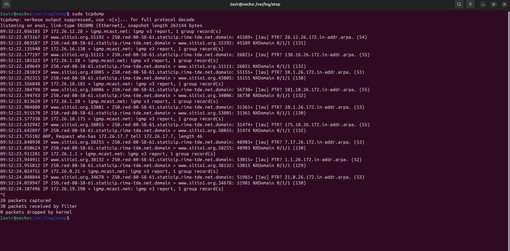
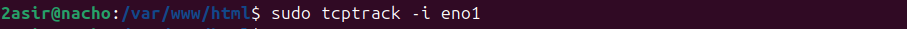
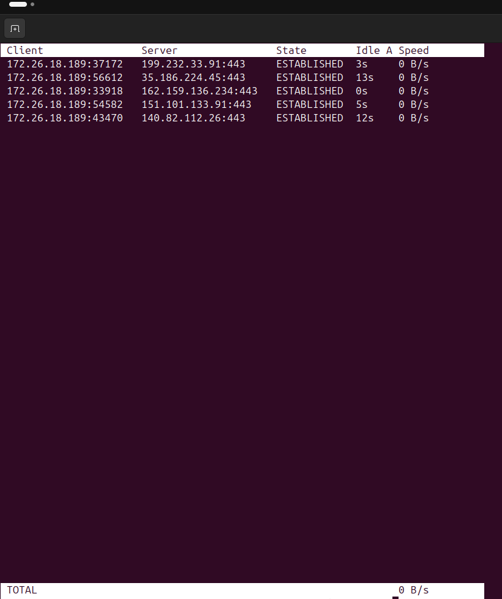
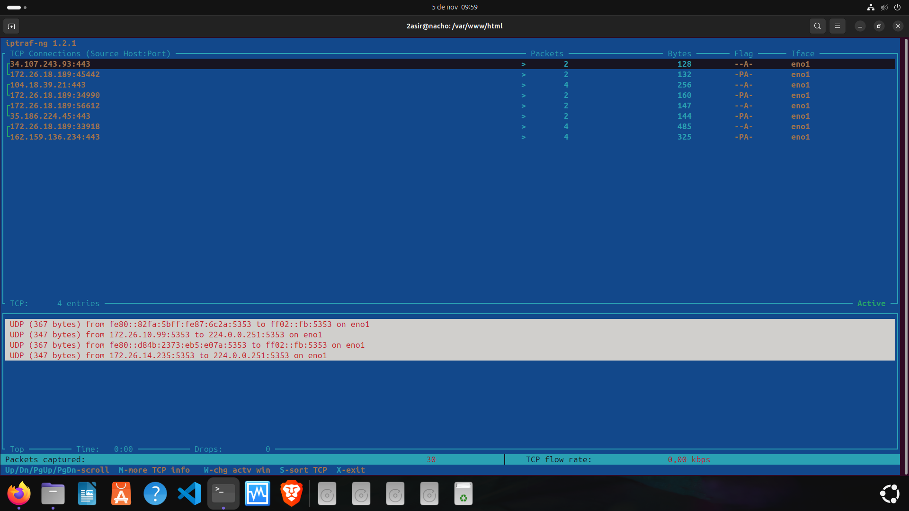
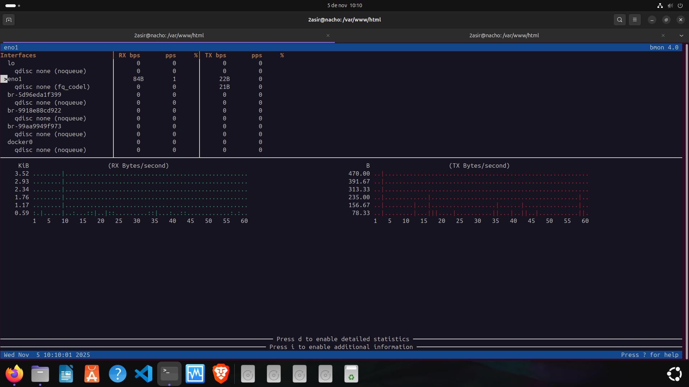

## [UD 3 Trafico de Red](../README.md)
### [TCPDUMP](#1-tcpdump)
### [TCPTRACK](#2-tcptrack)
### [IPTRAF](#3-iptraf)
### [BMON](#4-bmon)

-----

### 1. TCPDUMP

- `tcpdump` --> Captura los paquetes y vuelca el trafico de red para analizarlo.

  

  -----

  ### 2. TCPTRACK

- `tcptrack -i nombre_tarjeta_red` --> Monitoriza a tiempo real las conexiones tcp, de manera detallada.

  ### 3. IPTRAF

- `iptraf` --> Genera un menú con estadisticas detalladas de trafico ip, udp y tcp por puertos.

  
  
  ### 4. BMON

- `bmon` --> Monitoriza el ancho de banda y visualiza el trafico con graficos.

