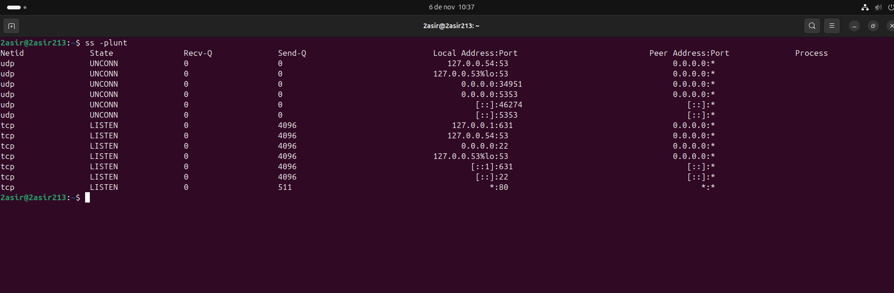
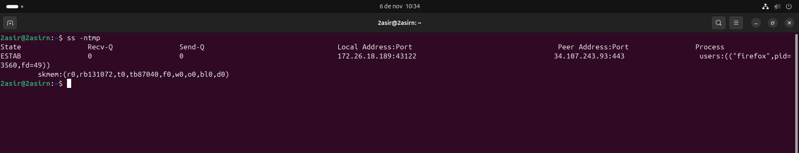
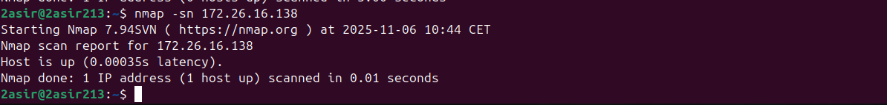
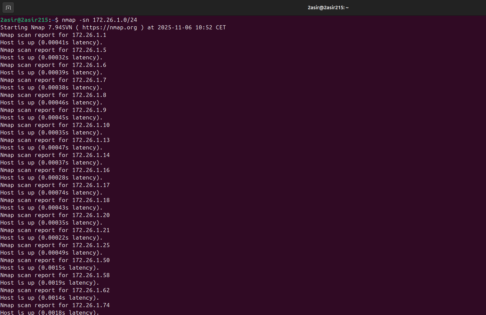
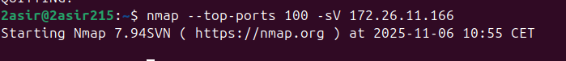
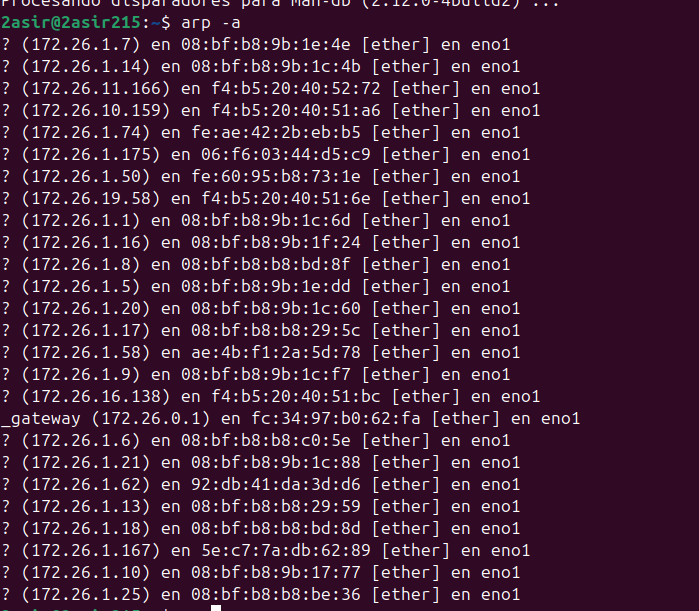
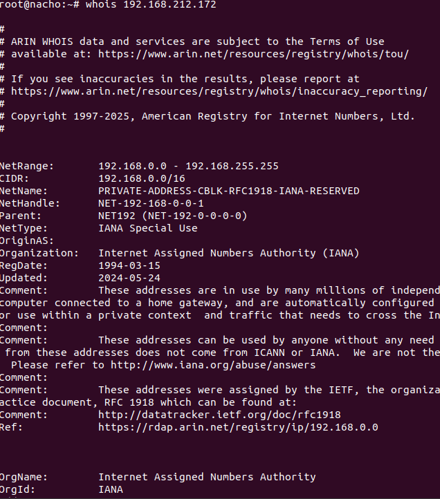

## [UD 4 Puertos](../README.md)
### [SS](#1-ss)
### [NMAP](#2-nmap)
### [ARP](#3-arp)
### [WHOIS](#4-whois)

-----

### 1. SS

- `ss -plunt` --> Muestra todos los puertos  tcp y udp que estan escuchando.

  

- `ss -ntmp` --> Lista de conexiones tcp con sus puertos y los procesos correspondientes.

  

  -----

  ### 2. NMAP

- `nmap -sn ip` --> Realiza un ping para verificar si el host de la ip esta activo.

- `nmap -sn direccion de red/mascara de red` --> Descubre todos los equipos activos de una red.

- `nmap --top-ports 100 -sV ip` --> Analiza los 100 puertos mas comunes del objetivo e intenta determinar la version exacta del servicio que corre en ellos.

  ### 3. ARP

- `arp -a` --> Muestra la tabla arp actual del sistema.

  
  
  ### 4. WHOIS

- `whois` --> Consulta las bases de datos de los registros regionales para revelar datos del objetivo.

